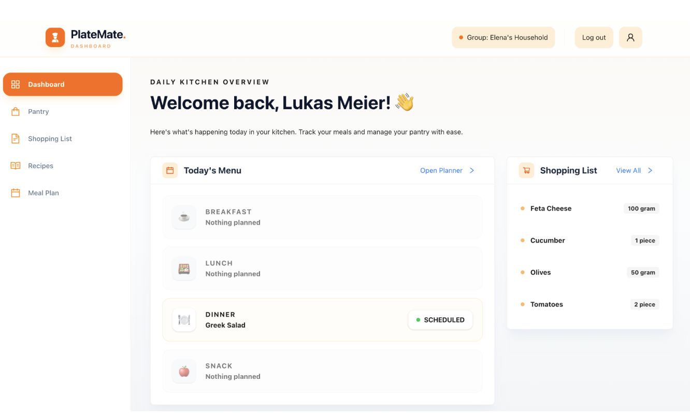
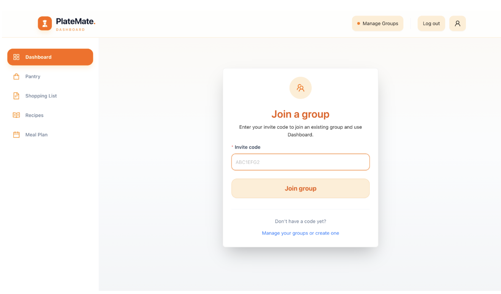
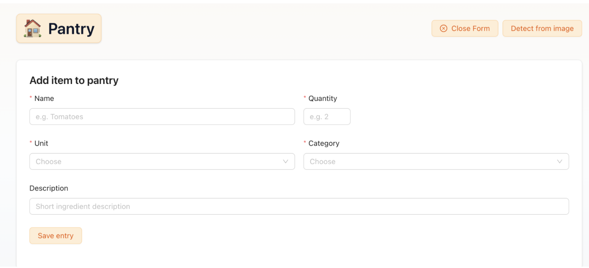
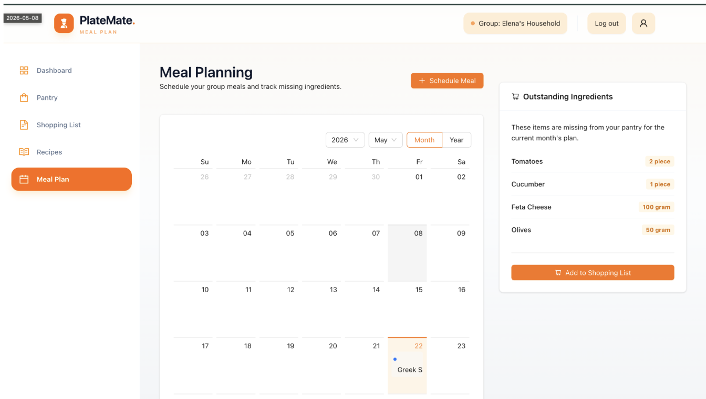
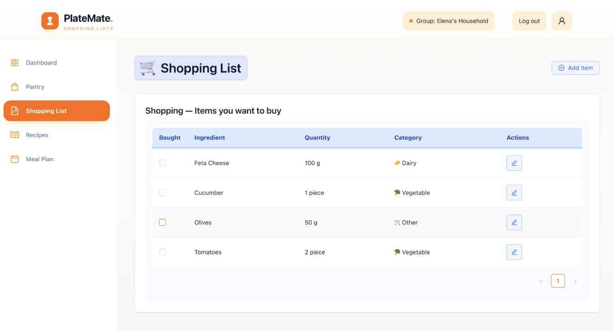
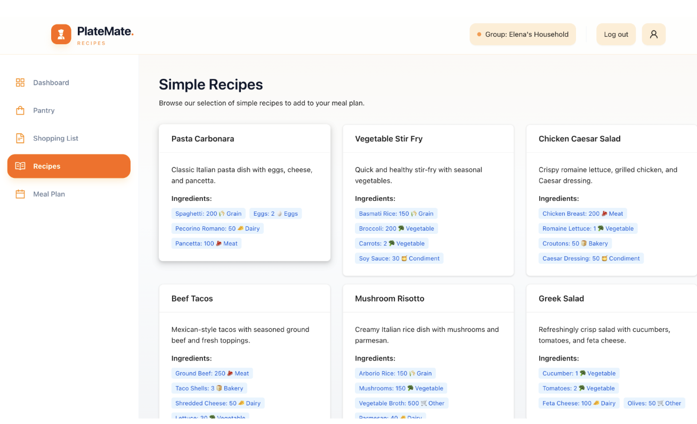

# PlateMate — Client

PlateMate is the Next.js & React frontend client for the PlateMate application, designed to simplify pantry management, meal planning, recipe discovery, cooking, and grocery shopping for shared households and families.

---

## 📖 Introduction
PlateMate is a collaborative web application designed for shared households to organize grocery shopping, recipe management, and meal planning. The main goal is to simplify recipe organization, shopping lists, and pantry inventories while improving coordination among household members.

### Core Features
- **Collaborative Household Spaces**: Household members share a real-time collaborative workspace with synchronized access to recipes, pantry items, and shopping lists to coordinate shopping and prevent duplicate purchases.
- **Pantry & Shopping List Sync**: Maintain a live pantry inventory of available ingredients. Items marked as purchased on the shared shopping list are automatically transferred to the pantry.
- **Recipe & Meal Planning**: Browse a preset collection of recipes and schedule them on the meal planner. Required ingredients for planned recipes can be automatically added to the shopping list.
- **Handwritten List Recognition**: Supports handwritten list recognition using external APIs integrated directly within the Pantry management section, allowing users to digitize paper lists and transfer them to the pantry in one step.

---

## 🛠️ Technologies Used
- **Framework**: Next.js (App Router)
- **UI Library**: React, Ant Design (component framework)
- **Styling**: TailwindCSS, Vanilla CSS
- **Programming Language**: TypeScript
- **Quality & Linting**: ESLint, Prettier
- **Network Client**: Fetch API with custom request wrappers

---

## 🧩 High-Level Components
The client interface is structured around several modular pages and components:

1. **[Dashboard-Shell](app/components/dashboard-shell.tsx)**:
   The primary layout wrapper. It acts as the navigation hub, displaying the sidebar menu and tracking the current active route to highlight chosen menu options across different pages.

2. **[Pantry Page](app/pantry/page.tsx)**:
   Allows users to view, add, and update food items in their pantry. It includes autocomplete suggestions powered by the backend ingredients API, automatic inventory deductions, and triggers image detection to parse handwritten grocery lists using OCR.

3. **[Dashboard Page](app/dashboard/page.tsx)**:
   The central landing hub for users, displaying today's scheduled meals and a summary of items currently on the shopping list.

4. **[Required Group Components](app/components/group-required.tsx) & [Hook](app/hooks/useGroupMembership.ts)**:
   Restricts page access for users who haven't joined or created a household group. The custom `useGroupMembership` hook checks the group state, prompting the user to create or join a household before letting them access pantry, list, or meal planning functionalities.

5. **[Meal Plan Page](app/meal-plan/page.tsx)**:
   Displays a calendar view where household members can schedule recipes. It shows the calculated missing ingredients for the planned meals and allows syncing them to the group's shopping list.

---

## 🚀 Launch & Development
To run the PlateMate client application locally:

### 1. Installation
Install the project dependencies using npm:
```bash
npm install
```

### 2. Configuration
Create a `.env.local` file in the root directory (if required) to set the backend base URL. (By default, the client points to the local backend port `8080` or the configured production gateway).

### 3. Local Development Commands
- **Run the Dev Server** (starts on `http://localhost:3000`):
  ```bash
  npm run dev
  ```
- **Build for Production**:
  ```bash
  npm run build
  ```
- **Start Production Server**:
  ```bash
  npm start
  ```
- **Lint Code**:
  ```bash
  npm run lint
  ```

---

## 📱 Illustrations: Core User Flows

### Dashboard Summary
The central landing page showing today's meals and shopping summary.


### 1. Household Onboarding
Upon first login, users are greeted with the `GroupRequired` screen. They can input a group token to join a flat/family space, or generate a new group to invite members.


### 2. Pantry Management
Users can view and update their shared pantry items. They can also scan physical lists using their phone camera (digitized instantly via OCR) or input manually with autocomplete.


### 3. Meal Planning to Shopping List Sync
Members schedule meals on the calendar. If ingredients are missing, they appear in the "Outstanding Ingredients" sidebar. Clicking "Add to Shopping List" appends them to the shopping list.


### 4. Real-Time Group Shopping
Users check off items at the grocery store. The checked-off items disappear from the shopping list and are instantly added to the pantry. Polling updates this in real-time for all household members.


### 5. Recipe Discovery
Find and save delicious recipes to cook.


---

## 🗺️ Roadmap
- **Real-Time Meal Voting**: A voting system in the planning page to let group members vote on what they want to eat.
- **AI Pantry Recipe Suggestions**: Recommend recipes to prepare based on what is close to expiring in the pantry.
- **Adding and Editing Recipes**: Allow users to manually create, update, or customize recipe details directly from the user interface.
- **Auto-Deduct Pantry Stock**: Automatically cross off and deduct ingredients from the pantry inventory when a scheduled recipe is marked as cooked.

---

## 👥 Authors & Acknowledgments
- **Marc Honegger** & **Karina Litvinova**

---

## 📄 License
This project is licensed under the MIT License. See [LICENSE](LICENSE) for more details.

Copyright (c) 2026 Marc Honegger & Karina Litvinova
